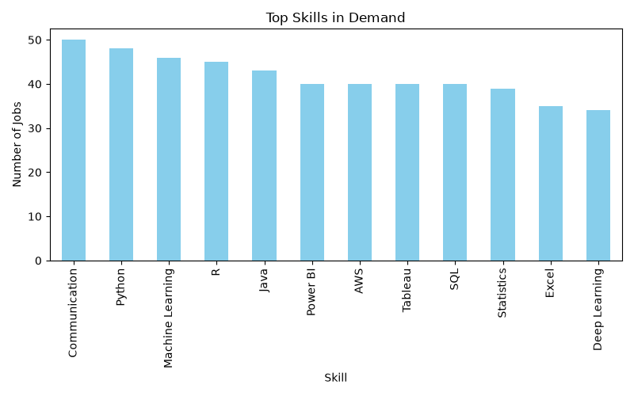
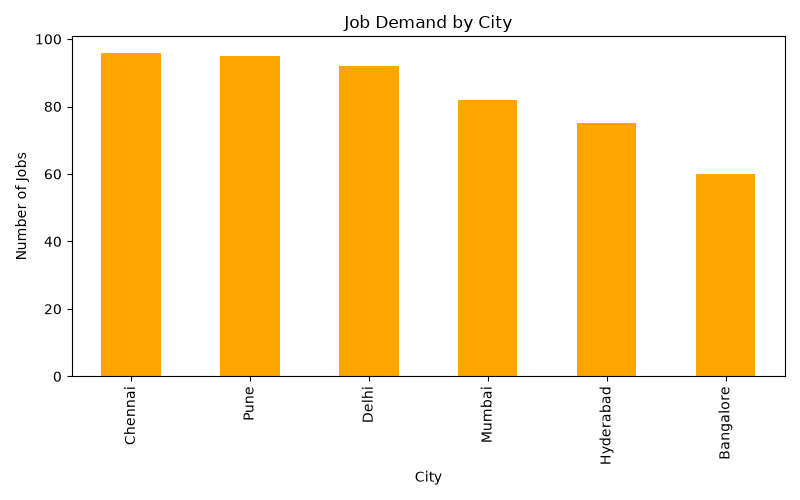

# Linkedin_Job_Trend_Analysis-Project
# 📊 LinkedIn Job Trend Analysis


> A data analytics project that uncovers **which skills are most in demand** and **which cities offer the highest job opportunities**, based on job posting data.

---

## 👩‍💻 Author

**Palak Saini**

---

## 📌 Overview

Skill demand and job availability constantly shift across cities and roles. This project analyzes job posting data to surface actionable insights — helping job seekers understand **what to learn** and **where to look** for the best opportunities.

---

## 🎯 Objective

- Identify the most in-demand skills across job postings
- Determine which cities have the highest concentration of job openings
- Map skills to specific job roles using a cross-tabulation matrix
- Deliver a clear, data-backed recommendation for job seekers

---

## 🛠️ Tools & Technologies

| Tool | Purpose |
|------|---------|
| 🐍 Python | Core scripting language |
| 🐼 Pandas | Data handling & aggregation |
| 📊 Matplotlib | Data visualization |

---

## 📈 Key Insights

| Metric | Result |
|--------|--------|
| 📄 Total Job Postings Analyzed | 500 |
| 🏆 Most In-Demand Skill | **Communication** |
| 🌆 Highest Job-Demand City | **Chennai** |
| 💼 Roles Covered | Data Analyst, Data Scientist, Software Engineer, Business Analyst, ML Engineer |
| 🏙️ Cities Covered | Bangalore, Mumbai, Delhi, Hyderabad, Pune, Chennai |

### 🔹 Top Skills in Demand





Communication, Python, and Machine Learning are the most frequently required skills — showing that employers value a strong mix of **technical and soft skills**.

### 🔹 Job Demand by City





Chennai, Pune, and Delhi show the highest job demand, proving that opportunities are spreading well beyond traditional tech hubs like Bangalore.

---

## 🧩 Methodology

1. Generated a structured job-postings dataset (Job Title, City, Skill)
2. Cleaned and loaded the data using **Pandas**
3. Aggregated skill and city frequencies to identify top trends
4. Built a **Skill vs Role matrix** using cross-tabulation
5. Visualized results with **bar charts** for clear comparisons

---

## 💡 Recommendation

> Candidates should prioritize strengthening their **Communication** and **Python** skills, as these show the highest demand across job postings. Job seekers may also consider exploring opportunities in **Chennai**, which currently leads in job openings among the analyzed cities.

---

## ▶️ How to Run

```bash
pip install pandas matplotlib
python scraper.py
python analysis.py
